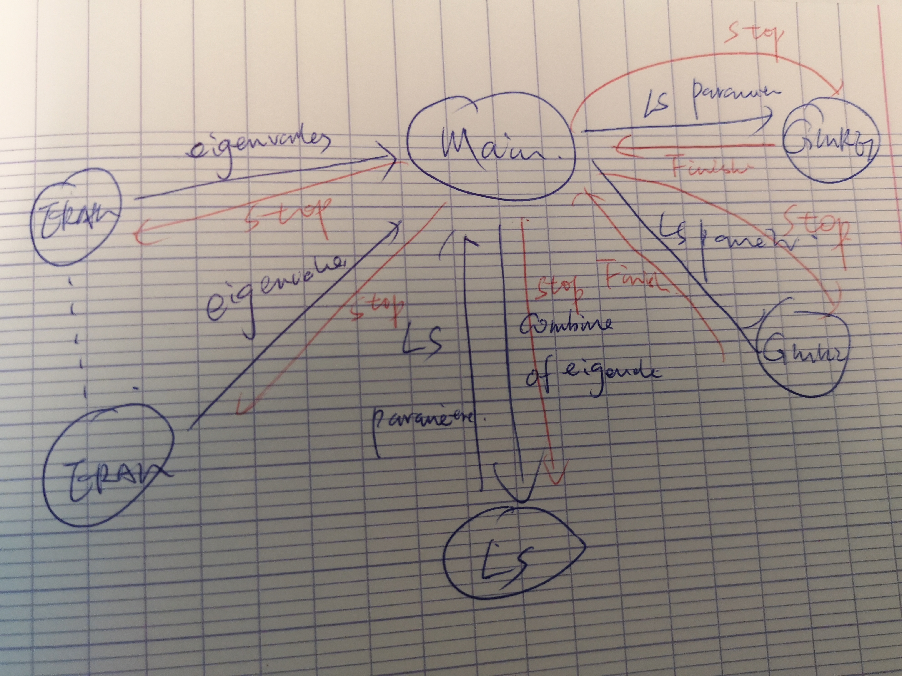

### Unite and Conquer Multiple GMRES/ERAM LS method implemented with MPI Spawn

Xinzhe WU @ Maison de la Simulation (xinzhe.wu@cea.fr)

Another similar implementation of [UCGLE](https://github.com/brunowu/UCGLE). The previous UCGLE uses a static MPI distributed communication implementation, thus the GMRES and ERAM Component numbers are fixed.

Here, we design a new dynamic distributed communication workflow by MPI_SPWAN. The Spawn functionality allows allocating multiple ERAM and GMRES Components. The multiple ERAM trends to be a [MERAM](https://epubs.siam.org/doi/10.1137/S1064827500366082)(Multiple Explicitly Restarted Arnoldi Method), the exchange of spectral information among the ERAM Components will improve the convergence of resolving no-Hermitian eigenvalue problems.

Meanwhile, multiple GMRES allows to solve simultaneously non-Hermitian linear systems with multiple right-hand sides. It is comparable with deflated [Block GMRES](http://www.sam.math.ethz.ch/~mhg/pub/delhipap.pdf), but with less global communication.

This software is underdevelopment by [Xinzhe Wu](https://brunowu.github.io/)...

#### To run

```bash
cmake .
make
mpirun -np 1 ./test.exe -nb_gmres 1 -proc_gmres 1 -nb_arnoldi 1 -proc_arnoldi 1 -gmres_exec ./gmres.exe -arnoldi_exec ./arnoldi.exe -lsqr_exec ./lsqr.exe --filename=\"utm300.mtx\" --eps-quiet --eps-nodebug --eps-exsitu --eps-sort=\"LM\" \ --eps-nonherm --eps-nev=10 --eps-blockSize=1 --eps-tol=0.1 --eps-no-print-matrix --eps-all-print --eps-numBlocks=20 --eps-maxRestarts=50 --ksp-nodebug --ksp-frequency=1 --ksp-tol=1e-05 --ksp-num-rhs=2 --ksp-block-size=2 --ksp-no-precond --ksp-num-blocks=120 --ksp-fixed-tol --ksp-no-print-matrix --ksp-all-print --ksp-no-dump-data --ksp-lsp-degree=2 --ksp-lsp-latency=1 --ksp-use-lsp > test.txt
```

#### Arnoldi Runtime Flags

```bash
  options:
  --help                               Prints this help message
  --pause-for-debugging                Pauses for user input to allow attaching a debugger
  --echo-command-line                  Echo the command-line but continue as normal
  --eps-verbose          bool          Print messages and results.
  --eps-quiet                          (default: --eps-quiet)
  --eps-debug            bool          Print debugging information.
  --eps-nodebug                        (default: --eps-nodebug)
  --eps-insitu           bool          Perform in situ restarting.
  --eps-exsitu                         (default: --eps-exsitu)
  --eps-sort             string        Targetted eigenvalues (SM or LM).
                                       (default: --eps-sort="LM")
  --eps-herm             bool          Solve Hermitian or non-Hermitian problem.
  --eps-nonherm                        (default: --eps-nonherm)
  --filename             string        Filename for Harwell-Boeing test matrix (assumes non-Hermitian unless specified otherwise).
                                       (default: --filename="")
  --eps-nev              int           Number of eigenvalues to compute.
                                       (default: --eps-nev=10)
  --eps-blockSize        int           Block size for the algorithm.
                                       (default: --eps-blockSize=1)
  --eps-tol              double        Tolerance for convergence.
                                       (default: --eps-tol=0.1)
  --eps-print-matrix     bool          Print the full matrix after reading it.
  --eps-no-print-matrix                (default: --eps-no-print-matrix)
  --eps-all-print        bool          All processors print to out
  --eps-root-print                     (default: --eps-root-print)
  --eps-numBlocks        int           Number of blocks in Krylov basis.
                                       (default: --eps-numBlocks=100)
  --eps-maxRestarts      int           Number of restarts allowed.
                                       (default: --eps-maxRestarts=100)
```


#### GMRES Runtime Flags

```
  options:
  --help                               Prints this help message
  --pause-for-debugging                Pauses for user input to allow attaching a debugger
  --echo-command-line                  Echo the command-line but continue as normal
  --ksp-verbose          bool          Print messages and results.
  --ksp-quiet                          (default: --ksp-verbose)
  --ksp-debug            bool          Run debugging checks.
  --ksp-nodebug                        (default: --ksp-nodebug)
  --ksp-frequency        int           Solvers frequency for printing residuals (#iters).
                                       (default: --ksp-frequency=-1)
  --ksp-tol              double        Relative residual tolerance used by solver.
                                       (default: --ksp-tol=1e-05)
  --ksp-num-rhs          int           Number of right-hand sides to be solved for.
                                       (default: --ksp-num-rhs=2)
  --ksp-block-size       int           Block size to be used by the solver.
                                       (default: --ksp-block-size=100)
  --ksp-use-precond      bool          Use a diagonal preconditioner.
  --ksp-no-precond                     (default: --ksp-no-precond)
  --ksp-num-blocks       int           Number of blocks in the Krylov basis.
                                       (default: --ksp-num-blocks=50)
  --ksp-reduce-tol       bool          Require increased accuracy from higher precision scalar types.
  --ksp-fixed-tol                      (default: --ksp-reduce-tol)
  --filename             string        Filename for Matrix-Market test matrix.
                                       (default: --filename="utm300.mtx")
  --ksp-print-matrix     bool          Print the full matrix after reading it.
  --ksp-no-print-matrix                (default: --ksp-no-print-matrix)
  --ksp-all-print        bool          All processors print to out
  --ksp-root-print                     (default: --ksp-root-print)
  --ksp-dump-data        bool          Dump raw data to data.dat.
  --ksp-no-dump-data                   (default: --ksp-no-dump-data)
  --ksp-lsp-degree       int           Least Square polynomial degree for preconditioning.
                                       (default: --ksp-lsp-degree=10)
  --ksp-lsp-latency      int           Latency of Least Square polynomial preconditioning to apply.
                                       (default: --ksp-lsp-latency=10)
  --ksp-use-lsp          bool          Whether to use LS polynomial preconditioning.
  --ksp-no-use-lsp                     (default: --ksp-use-lsp)
```

##### Workflow



